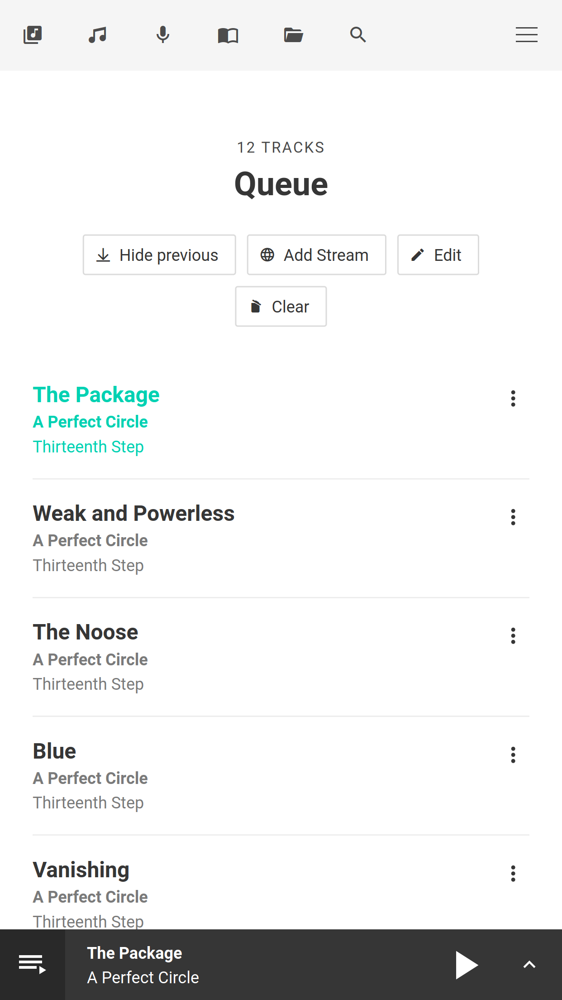
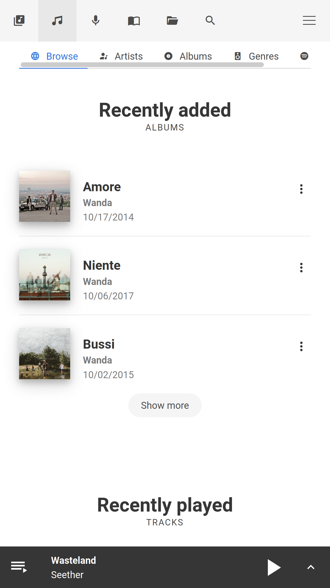
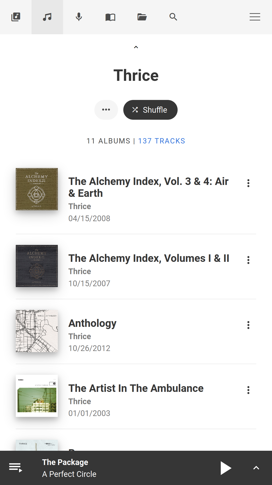
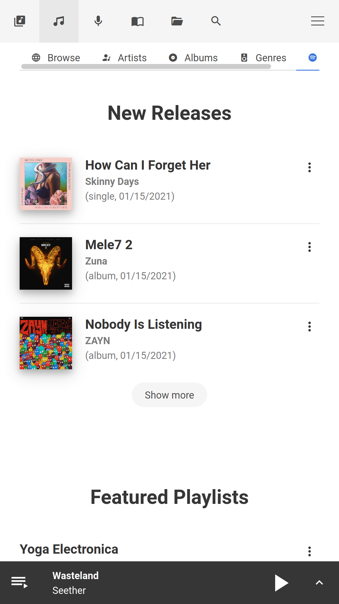
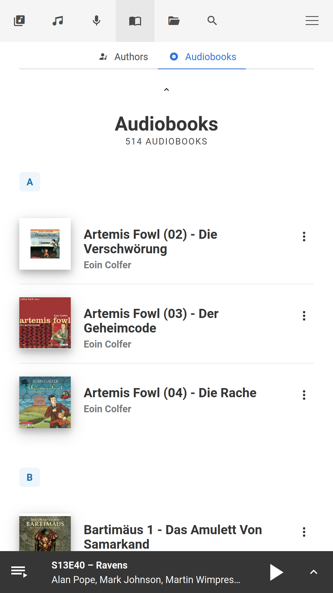
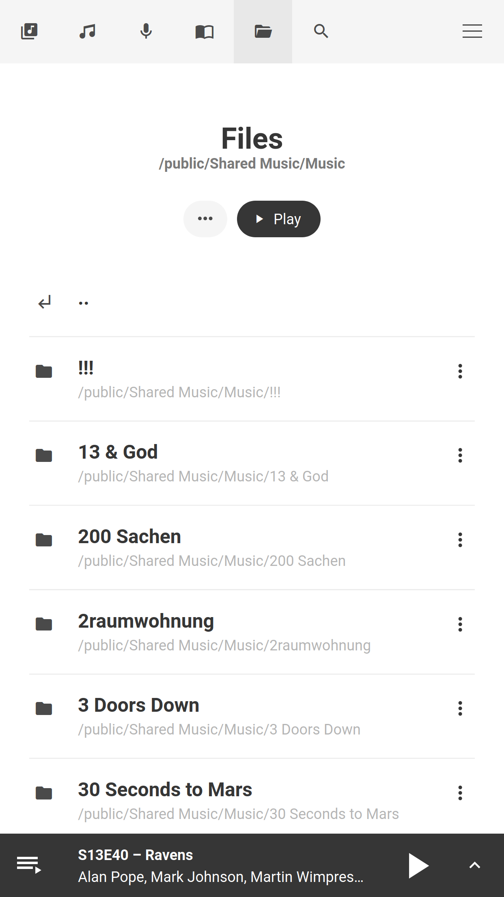
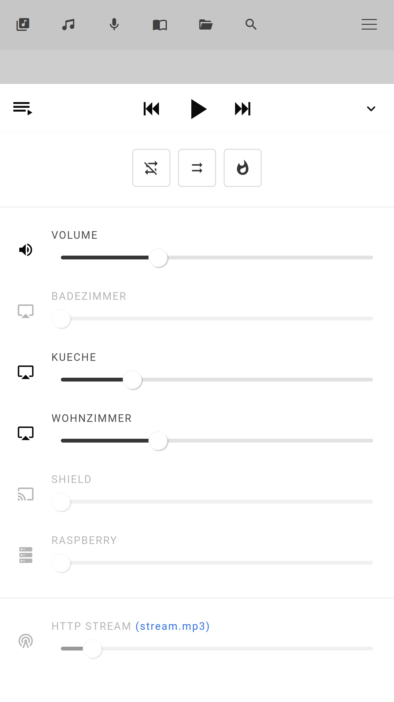

# OwnTone web interface

Mobile friendly player web interface for [OwnTone](http://owntone.github.io/owntone-server/) build
with [Vue.js](https://vuejs.org), [Bulma](http://bulma.io).

You can find the web interface at [http://owntone.local:3689](http://owntone.local:3689)
or alternatively at [http://[your_server_address_here]:3689](http://[your_server_address_here]:3689).

Use the web interface to control playback, trigger manual library rescans, pair
with remotes, select speakers, authenticate with Spotify, etc.

## Screenshots

{: class="zoom" }
{: class="zoom" }
{: class="zoom" }
{: class="zoom" }
{: class="zoom" }
{: class="zoom" }
{: class="zoom" }
{: class="zoom" }
{: class="zoom" }
{: class="zoom" }
{: class="zoom" }
{: class="zoom" }
{: class="zoom" }
{: class="zoom" }
{: class="zoom" }
{: class="zoom" }
{: class="zoom" }


## Usage

You can find OwnTone's web interface at [http://owntone.local:3689](http://owntone.local:3689)
or alternatively at [http://[your_server_address_here]:3689](http://[your_server_address_here]:3689).


## Build Setup

The source is located in the `web-src` folder.

```
cd web-src
```

The web interface is built with [Vite](https://vitejs.dev/), makes use of Prettier for code formatting
and ESLint for code linting (the project was set up following the guide [ESLint and Prettier with Vite and Vue.js 3](https://vueschool.io/articles/vuejs-tutorials/eslint-and-prettier-with-vite-and-vue-js-3/)

``` bash
# install dependencies
npm install

# Serve with hot reload at localhost:3000
# (assumes that OwnTone server is running on localhost:3689)
npm run serve

# Serve with hot reload at localhost:3000
# (with remote OwnTone server reachable under owntone.local:3689)
VITE_OWNTONE_URL=http://owntone.local:3689 npm run serve

# Build for production with minification (will update web interface
# in "../htdocs")
npm run build

# Format code
npm run format

# Lint code (and fix errors that can be automatically fixed)
npm run lint
```

After running `npm run serve` the web interface is reachable at [localhost:3000](http://localhost:3000).
By default it expects **owntone** to be running at [localhost:3689](http://localhost:3689) and proxies all
JSON API calls to this location.

If the server is running at a different location you have to set the env variable `VITE_OWNTONE_URL`.
