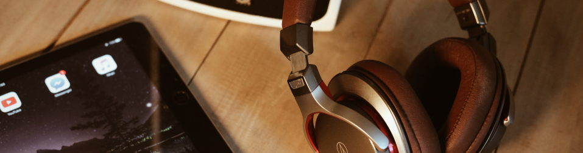

# OwnTone

**OwnTone** is an open source (audio) media server for GNU/Linux, FreeBSD
and MacOS.

It allows sharing and/or streaming your media library to iTunes (DAAP[^1]),
Roku (RSP), AirPlay devices (multiroom), Chromecast and also supports local playback.

You can control OwnTone via its web interface, Apple Remote (and compatible
DAAP/DACP clients), MPD clients or via its JSON API.

Besides serving your local music, podcast and audiobook media files,
OwnTone supports internet radios and Spotify (requires Spotify premium account).

OwnTone was previously called forked-daapd, which again was a rewrite of
mt-daapd (Firefly Media Server). It is written in C with a web interface written in Vue.js.

[^1]:
    DAAP stands for Digital Audio Access Protocol which is the protocol used by
    iTunes and friends to share/stream media libraries over the network.

## Features

- Stream to :material-apple-airplay: [AirPlay](outputs.md#airplay-devicesspeakers)
  (synchronized multiroom) and :material-cast: [Chromecast](outputs.md#chromecast)
  devices
- :material-music-box-multiple-outline: Share local library with iTunes and Roku
- :material-volume-high: Local audio playback with [ALSA or PulseAudio](outputs.md)
- Supports multiple different clients:

    - :material-cellphone: Remote apps like [Apple Remote (iOS) or Retune (Android)](remote.md)
    - :material-web: Integrated mobile friendly [web interface](webinterface.md)
    - :material-console: [MPD clients](mpd.md)

- [Supports](library.md) :material-music: music and :material-book-open-variant:
  audiobook files, :material-microphone: podcast files and :material-rss: RSS
  and :material-radio: internet radio
- :material-file-music: Supports audio files in most [formats](library.md#supported-formats)
- :material-spotify: Supports playing your [Spotify library](spotify.md) (requires
  Spotify premium account)
- :material-raspberry-pi: Runs on low power devices like the Raspberry Pi

---

[Getting started](getting_started.md){: .md-button .fd-button }

---

{: class="zoom" }
{: class="zoom" }
{: class="zoom" }

_(You can find more screenshots from OwnTone's web interface [here](webinterface.md))_
{: class="text-center" }

---

## Looking for help?

Before you continue, make sure you know what version of OwnTone you have,
and what features it was built with (e.g. Spotify support).

How to find out? Go to the [web interface](http://owntone.local:3689) and
check. No web interface? Then check the top of OwnTone's log file (usually
/var/log/owntone.log).

Note that you are viewing a snapshot of the instructions that may or may not
match the version of OwnTone that you are using.

If you are looking for help on building OwnTone (not using it), then
please see the documentation on [Building from Source](install.md).

## References

The source for this version of OwnTone can be found here:

[https://github.com/owntone/owntone-server.git](https://github.com/owntone/owntone-server.git)
