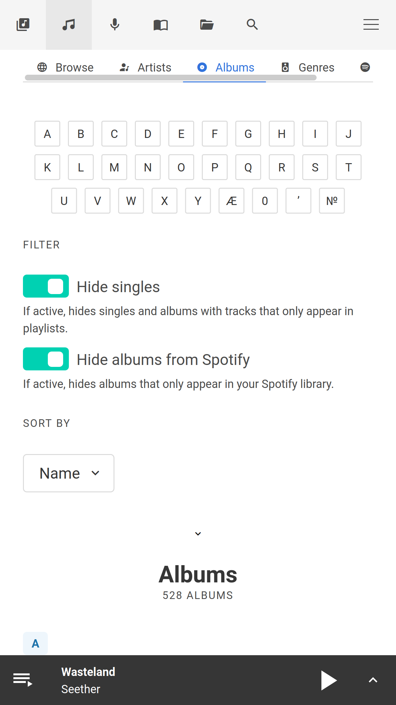
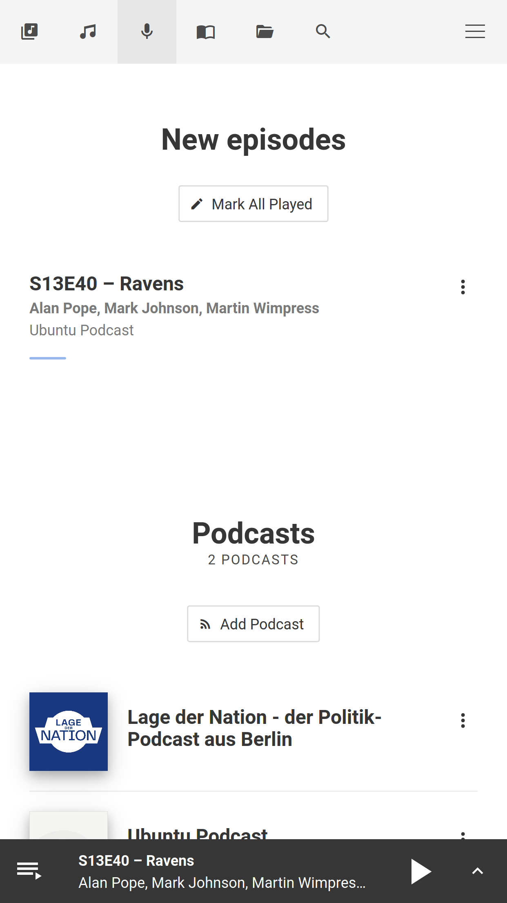

# Web interface

You can find forked-daapd's web interface at [http://forked-daapd.local:3689](http://forked-daapd.local:3689)
or alternatively at `http://[your_server_address_here]:3689`.

Use the web interface to control playback, trigger manual library rescans, pair
with remotes, select speakers, authenticate with Spotify, etc.

!!! important "Debian package"
    The Debian forked-daapd package does not include the web interface due to Debian
    packaging rules.

## Screenshots

{: class="zoom" }
{: class="zoom" }
{: class="zoom" }
{: class="zoom" }
{: class="zoom" }
{: class="zoom" }
{: class="zoom" }
{: class="zoom" }
{: class="zoom" }
{: class="zoom" }
{: class="zoom" }
{: class="zoom" }
{: class="zoom" }
{: class="zoom" }
{: class="zoom" }
{: class="zoom" }
{: class="zoom" }

## Build Setup

The source is located in the `web-src` folder.

```
cd web-src
```

It is based on the Vue.js webpack template. For a detailed explanation on how
things work, check out the [guide](http://vuejs-templates.github.io/webpack/)
and [docs for vue-loader](http://vuejs.github.io/vue-loader).

```bash
# install dependencies
npm install

# serve with hot reload at localhost:8080
npm run dev

# build for production with minification (will update player web interface in "../htdocs")
npm run build

# build for production and view the bundle analyzer report
npm run build --report
```

After running `npm run dev` the web interface is reachable at [localhost:8080](http://localhost:8080).
By default it expects **forked-daapd** to be running at [localhost:3689](http://localhost:3689)
and proxies all JSON API calls to this location. If **forked-daapd** is running
at a different location you need to modify the `proxyTable` configuration in `config/index.js`
